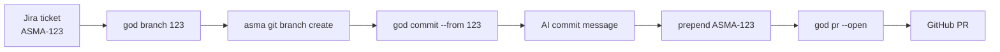

# ASMA Scripts

[](fish/god.fish)
[](zsh/god.zsh)
[](#-shell-support)
[](LICENSE)
[](https://cli.github.com/)

Personal shell scripts for the ASMA development workflow: one `god` helper command, shell completions, and a few daily shortcuts for Git, PRs, Jira-ticket branches, and `pnpm`.

## ✨ Highlights

- 🐟 Fish and 🐚 zsh support with matching `god` command behavior.
- 🧠 AI-assisted commits through `asma git commit`.
- 🧾 Jira ticket support for `ASMA-123` and short `123` input.
- 🚀 One-command branch, commit, push, and PR flow.
- 🔁 Safer commit-message amendment helper that preserves multiline bodies.
- ⚡ Small `pnpm` and directory shortcuts for daily use.

## 🐚 Shell Support

| Shell | Status | Command | Completions | Notes |
| --- | --- | --- | --- | --- |
| 🐟 fish | ✅ Supported | `fish/god.fish` | `fish/god.completions.fish` | Canonical fish function plus abbreviations. |
| 🐚 zsh | ✅ Supported | `zsh/god.zsh` | `zsh/_god` | Includes aliases, `mkcd`, and `_arguments` completions. |
| 🧱 bash | 🗓️ Planned | Not yet | Not yet | Good next target for broader Unix compatibility. |
| 🌊 nushell | 🗓️ Planned | Not yet | Not yet | Possible future structured-shell version. |
| 💠 PowerShell | 🗓️ Planned | Not yet | Not yet | Possible future cross-platform version. |

The current goal is feature parity between fish and zsh. Future shells can be added by keeping the same `god` subcommands and matching the behavior documented below.

## 🗺️ Workflow



## 📦 What's Inside

```text
scripts/
├── bin/
│   └── god-amend-from-task    # shared helper for multiline-safe commit amend
├── _docs/
│   └── COMMANDS.md            # detailed god command reference
├── fish/
│   ├── aliases.fish           # pnpm abbreviations + mkcd
│   ├── god.fish               # god command function for fish shell
│   └── god.completions.fish   # tab completions for god command
└── zsh/
    ├── god.zsh                # god command + pnpm aliases + mkcd for zsh
    └── _god                   # tab completions for god command in zsh
```

## 🧰 Requirements

| Tool | Used for |
| --- | --- |
| Git | Push, pull, merge commits, amend commits |
| GitHub CLI (`gh`) | Open and create pull requests |
| ASMA CLI (`asma`) | AI commits, recursive pulls, Jira branch creation |
| fish or zsh | Shell integration |
| `pnpm` | Included package-manager shortcuts |
| VS Code / Cursor `code` CLI | `god start` |

## 🚀 Installation

The scripts expect this checkout to be available at `~/asma/scripts` because `god commit --from` calls `~/asma/scripts/bin/god-amend-from-task`.

If you keep the repository somewhere else, update the sourced paths and the helper path inside `fish/god.fish` and `zsh/god.zsh`.

### Fish

```fish
# Source the canonical function from your personal fish function file
printf '%s\n' 'source "$HOME/asma/scripts/fish/god.fish"' > ~/.config/fish/functions/god.fish

# Install aliases and completions
cp fish/aliases.fish ~/.config/fish/conf.d/aliases.fish
cp fish/god.completions.fish ~/.config/fish/completions/god.fish

# Reload the current session
source ~/asma/scripts/fish/god.fish
complete -e -c god
source ~/.config/fish/completions/god.fish
```

### Zsh

```zsh
# Source the command from ~/.zshrc
echo 'source "$HOME/asma/scripts/zsh/god.zsh"' >> ~/.zshrc

# Install completions
mkdir -p ~/.zsh/completions
cp zsh/_god ~/.zsh/completions/_god

# Ensure custom completions are on fpath before compinit
# Put this in ~/.zshrc before compinit:
# if [ -d "$HOME/.zsh/completions" ]; then
#   fpath=("$HOME/.zsh/completions" $fpath)
# fi

# Reload the current session
autoload -Uz compinit
compinit -i
source ~/.zshrc
```

## 🕹️ Quick Command Reference

| Flow | Command |
| --- | --- |
| Push and pull | `god push`, `god pull`, `god pull --master`, `god pull --recursive` |
| AI commits | `god commit`, `god commit --from 123`, `god commit --release`, `god commit --no-verify` |
| Branches and PRs | `god branch 123`, `god pr 123`, `god pr --open` |
| Workspace | `god start` |
| Help | `god help` |

For the full command reference, examples, merge behavior, `master` behavior, and completion details, see [_docs/COMMANDS.md](_docs/COMMANDS.md).

### Ticket Format

Both formats are accepted:

```text
ASMA-123
123
```

Short numeric ticket IDs are automatically expanded to `ASMA-<number>`.

## ⚡ Shortcuts

Available in both fish (`fish/aliases.fish`) and zsh (`zsh/god.zsh`):

| Shortcut | Expands to |
| --- | --- |
| `pdev` | `pnpm dev` |
| `padd` | `pnpm add` |
| `prem` | `pnpm remove` |
| `mkcd <dir>` | `mkdir -p <dir> && cd <dir>` |

## 🧪 Quick Check

After installation, verify the basics:

```sh
god help
god pull --master --dry-run
god pr --open
```

For completion changes, reload the target shell and check that subcommands, flags, and Jira ticket suggestions appear after `--from`.

## 🤝 Contributing

Contributions are welcome if they keep the scripts small, readable, and aligned across fish and zsh.

Before opening a pull request:

- Test changes in the shell they affect.
- Keep fish and zsh command behavior in sync when possible.
- Update this README when command behavior or installation steps change.

See [CONTRIBUTING.md](CONTRIBUTING.md) for more details.

## 🔐 Security

These scripts automate local Git, GitHub CLI, and ASMA CLI workflows, so review changes carefully before sourcing them in your shell.

If you find a security issue, please follow [SECURITY.md](SECURITY.md).

## 📄 License

Released under the [MIT License](LICENSE).
